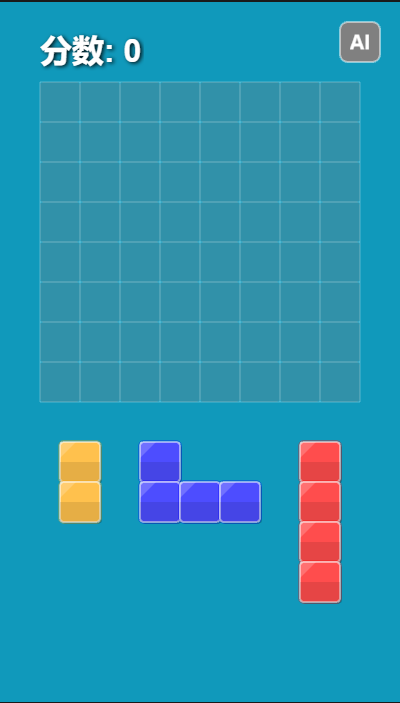

# BlockBlast - 方块消除游戏

一个基于 TypeScript 和 PixiJS 开发的现代方块消除游戏。玩家需要通过策略性地放置不同形状的方块来消除完整的行或列，获取高分。

🎮 [在线体验地址](https://aerse.github.io/seed-block-blast/) 🕹️



## 功能特性

- 🎮 流畅的拖放操作体验
- ✨ 精美的视觉效果和动画
- 🎯 智能的方块放置预览
- 🌈 丰富的颜色和形状变化
- 🤖 内置 AI 模式
- 💥 华丽的消除特效
- 📱 支持高 DPI 显示

## 技术栈

- TypeScript - 类型安全的 JavaScript 超集
- PixiJS - 高性能 2D 渲染引擎
- GSAP - 专业级动画库
- Webpack - 模块打包工具

## 安装说明

1. 克隆项目到本地：
```bash
git clone [项目地址]
cd blockBlast
```

2. 安装依赖：
```bash
npm install
```

3. 启动开发服务器：
```bash
npm run dev
```

4. 构建生产版本：
```bash
npm run build
```

## 游戏玩法

1. 在游戏区域下方会显示三个随机形状的方块
2. 通过拖拽将方块放置到游戏板上合适的位置
3. 当一行或一列被完全填满时，该行或列会被消除，并获得分数
4. 合理规划方块放置位置，尽可能多地消除行和列
5. 当无法放置更多方块时游戏结束

## AI 模式

点击右上角的 AI 按钮可以启用 AI 模式，观察 AI 如何玩游戏：
- AI 会自动分析最佳放置位置
- 考虑多个策略因素（消除可能、空隙、相邻方块等）
- 实时展示 AI 的决策过程

## 开发说明

### 项目结构
```
src/
  ├── Game.ts      - 游戏核心逻辑
  ├── constants.ts - 游戏常量配置
  ├── types.ts     - TypeScript 类型定义
  └── index.ts     - 游戏入口文件
```

### 主要功能模块

- 游戏板管理
- 形状生成和控制
- 碰撞检测
- 消除判定
- 分数系统
- 粒子效果
- AI 决策

## 贡献指南

欢迎提交 Issue 和 Pull Request 来帮助改进游戏。在提交代码前，请确保：

1. 代码符合项目的代码规范
2. 添加了必要的注释和文档
3. 所有的 TypeScript 类型定义完整
4. 测试过主要功能正常工作

## 许可证

MIT License - 详见 LICENSE 文件 